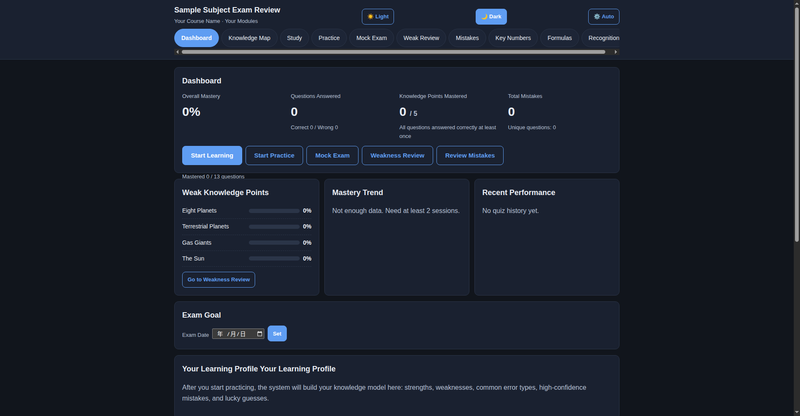
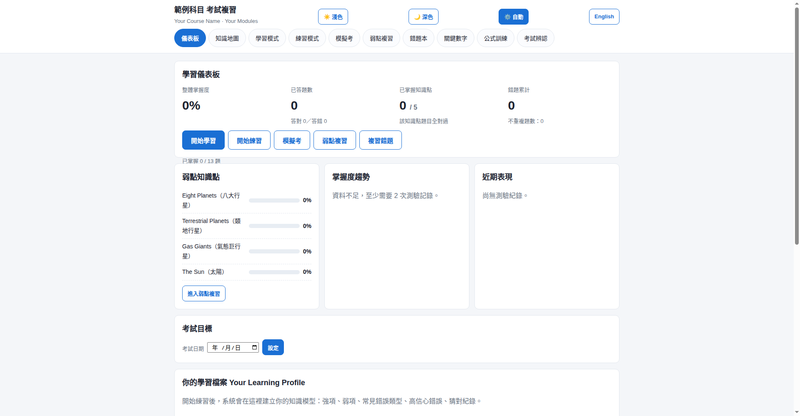

# Exam Review Website Template

[中文版](README.md)

[](LICENSE)

> 🌐 **Live demo**: https://darrenchih.github.io/exam-review-template/

## What Is This

A **single-file, offline** exam review website: 8 study modes (study, practice, mock exam, weak review, mistake log, critical numbers, formula trainer, exam recognition) with progress saved automatically in your browser. **No install, no internet, no server required** — download and double-click to use.

Want one for your own subject? **Just copy a message and paste it to any AI** — the AI handles the rest (see "Generate One for Your Subject" below).

## Try It Now

- **Online**: click the demo link above and pick any of the 4 language variants
- **Local**: download any `variants/*.html` and open it in your browser

> The demo is a trimmed showcase: 12 questions (9 multiple-choice + 3 true/false), 5 knowledge cards, 4 critical numbers, 1 formula, 4 recognition items, using "Eight Planets" sample data. Properly generated sites contain 60–100 questions.

## Features (identical across all 4 variants)

- 📖 Study mode (knowledge cards: definition / function / mechanism / distinction / key facts / traps)
- ✏️ Practice mode (adaptive question selection, per-option explanations)
- 📝 Mock exam mode (timer, unified submit, keyboard shortcuts)
- 🎯 Weak review (spaced repetition)｜❌ Mistake log｜⭐ Favorites
- 🔢 Critical numbers｜📐 Formula trainer｜🔍 Exam recognition
- 📊 Learning profile (trend chart, strengths/weaknesses, exam countdown)
- 💾 Local storage + JSON export/import｜🖨️ Print｜🌙 3 themes (light/dark/auto)

## Screenshots

Sample data shown:

| All English | All Chinese |
|-------------|-------------|
|  |  |

| Mixed (Chinese primary) | Mixed (English primary) |
|-------------------------|-------------------------|
|  |  |

## Generate One for Your Subject

**Two steps, no AI experience needed:**

1. **Copy the message below** (replace "All Chinese" with the variant you want: All Chinese / All English / Chinese primary / English primary)
2. **Paste it to any AI** (ChatGPT, Claude, Muse…), then just answer its questions

```
I want to generate an exam review website for my subject using this template.

Repo: https://github.com/Darrenchih/exam-review-template
Language variant I want: All Chinese (choose one: All Chinese / All English / Chinese primary / English primary)

Please:
1. Read the matching prompt (prompts/), HTML template (variants/), and DATA_FORMAT.md from the repo:
   - All Chinese → prompts/PROMPT_ZH.md + variants/template-zh.html
   - All English → prompts/PROMPT_EN.md + variants/template-en.html
   - Chinese primary → prompts/PROMPT_ZH_MIXED.md + variants/template-zh-mixed.html
   - English primary → prompts/PROMPT_EN_MIXED.md + variants/template-en-mixed.html
2. Follow Phase 1 of the prompt: confirm the subject name and exam scope with me first, then continue.
```

The AI reads everything from the repo itself, confirms your subject and scope first, then researches, generates 60–100 questions, fills the template, validates, and delivers. **You don't need to download anything** or know how AI works.

## Four Language Variants

| Variant | HTML | Prompt | Description | Best for |
|---------|------|--------|-------------|----------|
| All English | `variants/template-en.html` | `prompts/PROMPT_EN.md` | UI + questions all English, language locked | English exams, international certifications |
| All Chinese | `variants/template-zh.html` | `prompts/PROMPT_ZH.md` | UI + questions all Chinese, language locked | Chinese exams, domestic certifications |
| Mixed (Chinese primary) | `variants/template-zh-mixed.html` | `prompts/PROMPT_ZH_MIXED.md` | Chinese default, switchable to English | Studying in Chinese, English terminology |
| Mixed (English primary) | `variants/template-en-mixed.html` | `prompts/PROMPT_EN_MIXED.md` | English default, switchable to Chinese | English exams with Chinese support |

## Files

| File | Description |
|------|-------------|
| `WORKFLOW.md` | Replicable workflow: pick language → give instruction → verify → deliver → iterate |
| `DATA_FORMAT.md` | Field specifications for all 9 data structures |
| `CONTRIBUTING.md` | Contribution guide (bilingual) |
| `KNOWN_ISSUES.md` | Known issues tracker |
| `DISCLAIMER.md` | Disclaimer (bilingual) |
| `CHANGELOG.md` | Version history |
| `template.html` | Base template (English-primary mixed) |
| `variants/` | 4 HTML variants |
| `prompts/` | 4 AI instructions |

## FAQ

**Q: Blank page on open?**
A: Open with Chrome / Edge / Safari and make sure JavaScript is enabled. Just double-click the HTML file — no server needed.

**Q: Where is my progress stored? Is it uploaded?**
A: Only in your browser's localStorage — never uploaded anywhere. Switching browsers or clearing site data will erase it; use the in-site "Export progress (JSON)" to back up.

**Q: Why does the demo only have 12 questions?**
A: The demo is a trimmed showcase. Properly generated sites contain 60–100 questions.

**Q: Will progress for multiple subjects overwrite each other?**
A: Yes, if they share the same localStorage key. Use a unique key per subject (e.g. `math101_en_v1`); see `WORKFLOW.md` notes.

**Q: No language toggle in the All-English / All-Chinese variant?**
A: By design — those two variants lock a single language. Use a mixed variant if you need switching.

**Q: Can I use AI-generated questions directly for my exam?**
A: No. Always spot-check AI output — especially numbers and formulas in technical subjects — against your course materials and classroom instruction. See the [Disclaimer](DISCLAIMER.md).

## Disclaimer

In short: AI-generated content may be wrong — verify against your course materials; this project is a study aid only and does not guarantee exam results; not affiliated with any school or examination body; use at your own risk. Full text in [DISCLAIMER.md](DISCLAIMER.md).

## License

MIT — see [LICENSE](LICENSE). Everyone is free to copy, use, modify, and share.
